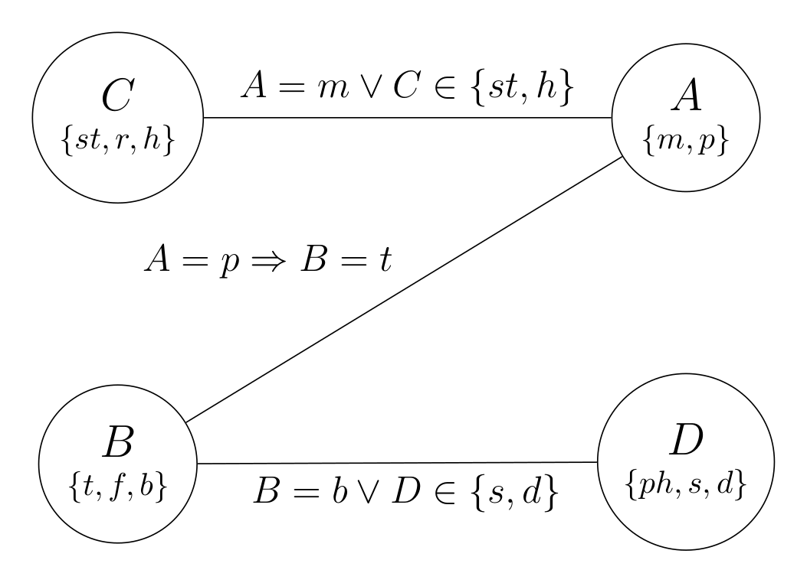

# Part A

## A-1. CSP

### Q1

> Draw the constraint graph over the variables A, B, C, and D.

### Q2

> Imagine we first assign A = p. Cross out eliminated values to show the domains of the variables after forward checking.

$D_A = \set{\sout{m}, p} \iff A = p$  
$D_B = \set{t, \sout{f}, \sout{b}} \iff B = t$  
$D_C = \set{st, \sout{r}, h}$  
$D_D = \set{ph, s, d}$

### Q3

> Again imagine we first assign A = p. Cross out eliminated values to show the domains of the variables after arc consistency has been enforced.

$D_A = \set{\sout{m}, p} \iff A = p$  
$D_B = \set{t, \sout{f}, \sout{b}} \iff B = t$  
$D_C = \set{st, \sout{r}, h}$  
$D_D = \set{\sout{ph}, s, d}$

### Q4

> Assume that exactly one value is chosen from the domain of each variable (i.e., one attraction, one boarding option, one cuisine, and one destination memory must be selected). Give at least two solutions for this CSP, or state that none exists.

- Solution #1: $\set{A = p, B = t, C = st, D = s}$  
- Solution #2: $\set{A = p, B = t, C = st, D = d}$

## A-2. Search

### Q5

> What path will BFS tree search return?

$S \to G$

### Q6

> What path will UCS tree search return? 

$S \to B \to D \to G$

### Q7

> For the A* graph search, complete the table below by writing the path expanded, and the fringe (ordered by path) step by step, until the goal state is reached.

**let $_h^f N_g$ means $g(N) = g, h(N) = h, f(N) = g + h = f$**
|Path Expanded|Closed List|Fringe|
|---|---|---|
|-|$\set{}$|$S(6)$|
|$S$|$\set{S}$|$S \to A(2)$ $S \to B(7)$ $S \to G(9)$|
|$S \to A$|$\set{S, A}$|$S \to A \to D(6)$ $S \to B(7)$ $S \to A \to C(8)$ $S \to G(9)$|
|$S \to A \to D$|$\set{S, A, {}_5^6D_1}$|$S \to B(7)$ $S \to A \to C(8)$ $S \to A \to D \to G(9)$ $S \to G(9)$|
|$S \to B$|$\set{S, A, {}_5^6D_1, B}$|$S \to B \to D(4)$ $S \to A \to C(8)$ $S \to A \to D \to G(9)$ $S \to G(9)$ $S \to B \to E(15)$|
|$S \to B \to D$|$\set{S, A, B, {}_3^4D_1}$|$S \to B \to D \to G(7)$ $S \to A \to C(8)$ $S \to G(9)$ $S \to B \to E(15)$|
|$S \to B \to D \to G$|$\set{S, A, B, D, G}$|$S \to B \to D \to G(7)$ $S \to A \to C(8)$ $S \to G(9)$ $S \to B \to E(15)$|
